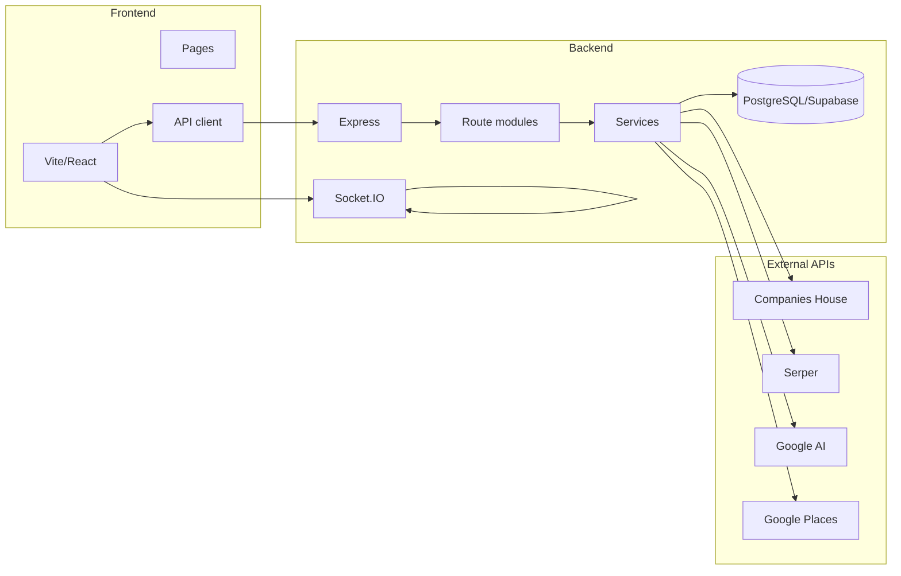

# CHScanner Architecture

This document describes the high-level architecture of CHScanner: components, data flow, and configuration.

## Overview

CHScanner is a full-stack lead generation and enrichment application. The backend is a Node.js Express server with Socket.IO for real-time log streaming; the frontend is a React SPA built with Vite. Data is stored in **PostgreSQL** (Supabase or any Postgres) via the `pg` driver. API keys and profile settings can be stored in the database (Profile table) and override environment variables at runtime.

## Backend

- **Entry:** `src/server.js` — creates the HTTP server, Express app, and Socket.IO; mounts middleware and route modules; serves static UI from `dist/`.
- **Routes:** API handlers are organised under `src/routes/` (e.g. `leads.js`, `profile.js`, `chCache.js`). Each router is mounted under `/api` or a specific path.
- **Services:** Business logic lives in `src/services/` (database, Companies House, Serper, scraper, AI, CRM push, etc.). Route handlers call services and send HTTP/JSON responses.
- **Pipeline:** `src/index.js` exports `runPipeline`, which orchestrates lead sources (JSON file, Companies House, Google Maps, etc.), enrichment (Serper → Playwright → optional AI), and persistence. The server and CLI both use this pipeline.
- **Database:** PostgreSQL (Supabase or any Postgres). Schema is managed via migrations (`db/migrations/001_init.sql`); apply once in Supabase SQL Editor or via `psql`. Runtime does not create tables.

## Frontend

- **Entry:** `ui/index.html` + `ui/src/main.jsx` — React root and global styles.
- **App:** `ui/src/App.jsx` — hash-based routing, layout, Socket.IO connection for logs, theme (dark/light). Renders page components based on the current route.
- **Pages:** Under `ui/src/pages/` (Home, Leads, Kanban, Profile, Analytics, Outreach, DB Management, Logs, Lead Profile, Company Detail).
- **Components:** Reusable UI under `ui/src/components/` (e.g. LeadsSidebar, CompaniesTable, LeadProfile, StatusBadge).
- **API:** `ui/src/api/client.js` provides a base URL and methods (`get`, `post`, `patch`, `delete`) for calling the backend. Optional `endpoints.js` centralises path constants.
- **State:** No global store; component state and props. Socket.IO and fetch are used for live logs and API data.

## Data Flow

1. **Lead ingestion:** User runs pipeline (UI “Run Pipeline” or CLI `node src/index.js`) → pipeline loads companies from selected source → Serper finds website → Playwright scrapes contacts → optional AI ice-breaker → rows written to `leads` (and optionally list membership in `list_lead`).
2. **Find leads (UI):** User searches Companies House cache via `GET /api/ch-cache/search` → results from `ch_cache` table → user selects companies and “Save to List” → `POST /api/leads/save-to-list` creates/updates leads and list membership.
3. **Kanban / lead management:** Leads are read via `GET /api/leads` (optional `listId`). Status updates go through `PATCH /api/leads/:id`. Score and outreach draft use `POST /api/leads/:id/score` and `POST /api/leads/:id/outreach-draft` (Google AI).
4. **Profile & keys:** API keys and settings are in the `profile` table. Keys set in the UI override `.env`. Resolution order: Profile (DB) → `.env` → missing (error or empty).

## Configuration

- **Server:** `PORT`, `DATABASE_URL` (required), `NODE_ENV`, `LOG_LEVEL`, `LOG_PRETTY` (see [DEPLOYMENT.md](DEPLOYMENT.md)).
- **Pipeline:** `config.js` and CLI/env: `INPUT_FILE`, `DELAY_BETWEEN_COMPANIES_MS`, `--limit`, `--input`, `--source`.
- **API keys:** Stored in `profile` (UI) or in `.env` (see README and `.env.example`). No secrets are sent to the client; only masked values are returned by `GET /api/profile`.

## Build and Serve

- **Development:** `npm run dev` — backend on port 3001, Vite dev server on 5173; Vite proxies `/api` and `/socket.io` to the backend.
- **Production:** `npm run build` builds the UI and copies output to root `dist/`. `npm start` runs the backend and serves `dist/`; all API and Socket.IO traffic goes to the same origin.

For more detail on endpoints, see [API.md](API.md). For deployment and environment variables, see [DEPLOYMENT.md](DEPLOYMENT.md).
